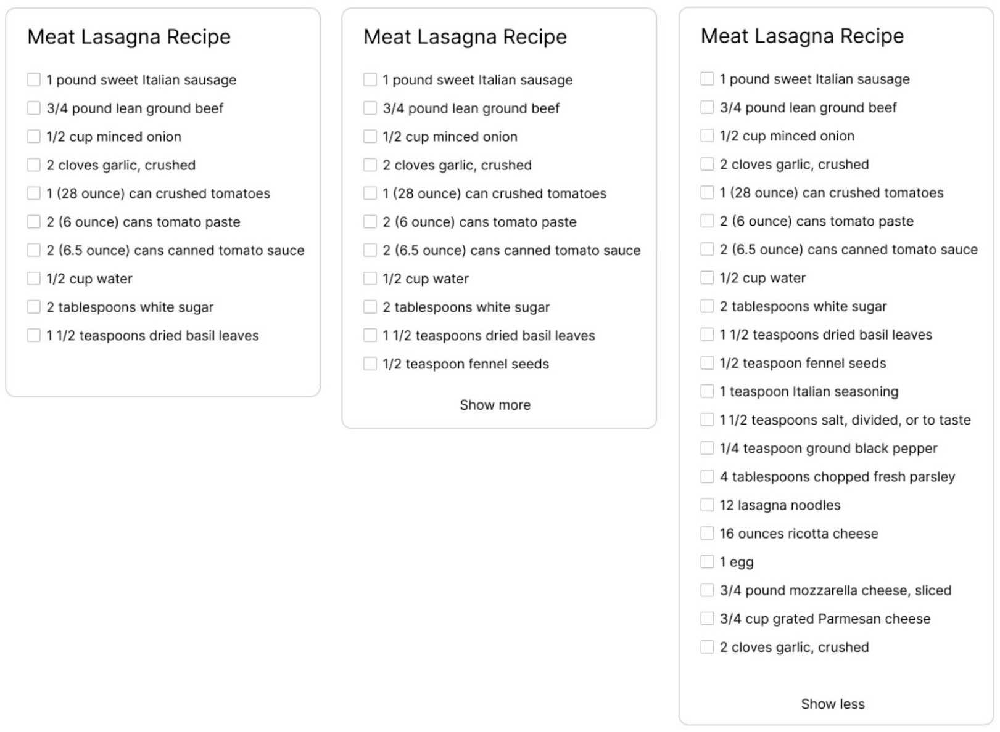

# Demo Project for Kagi

## Task 1 - HTML Recipes



_Task brief has been reworded for clarity; original below_

A recipe widget has:

- a recipe title
- a list of ingredients
- a checkbox for each ingredient
- a non-JS toggle to allow the user to show or hide ingredients in the list beyond the 10th, but only if there are more than 10 ingredients
- that toggle has different copy ('Show More'/'Show Less') depending on whether the list is fully expanded or not

Two instances of the same recipe widget are desired; the only difference is how long its list is:

- one instance has the full list of 21 ingredients (so the user sees an option to show the full list, or hide ingredients beyond the 10th)
- one instance has a shorter list of only 10 items (so the user is not shown an option to show the full list)

### Original brief

_The image, by the way, shows 11 ingredients on the collapsed widget – but the brief says '10 lines of text should be visible when collapsed’ – so you may want to revise that, and maybe indicate the second and third widget in the image are actually the same one in different states._

- Make a recipe widget as shown in the image.
- Clicking 'Show More' should expand the content of the widget. When expanded, the text should change to 'Show Less'.
- Clicking 'Show Less' should collapse the content.
- 'Show More' should only be visible if Ingredients exceed 10.
- There is no need to add, edit, or delete Ingredients for this widget, the idea is to make 'Show More/Show Less' functionality _without_ javascript.
- Make 2 examples: one with checkboxes (as shown in the image), and another with just text.
- For that second, text-only example, there should be 15 lines (or more) of text. 10 lines of text should be visible when collapsed, and when expanded another 5 should show up.
- No JavaScript at all for this one.

## Task 2 - JavaScript Optimization

You are at the court for a traffic ticket, and there are 4 other people with you.

You are told that everyone’s hearing is in alphabetical order, and it takes 30 minutes for each hearing.

All of the judges are free now and can see one person at a time. How long will it take for your hearing to end?

Your inputs are:

- Your name (as a string)
- The number of judges (an integer)
- The names of four other people separated by space (as a string)

Example:

```js
court('Jules', 3, 'Adam Betty Frank Mike');
// => 60m

court('Zane', 1, 'Mark Hank Ana Vivian');
// => 150m
```

Write the fastest JavaScript routine (include a simple benchmark) that you possibly can. Submit when you can not get it any faster and explain your optimization journey.

### First stab

This made sense to me and looked good at first, but some tests had nonsensical results – `court('Mickey', 2, 'Bobby Phil Jerry Billy')` was getting me 75 minutes, which … could not be right.

```js
// Typical execution time: 0.09999990463256836ms

function court(defendant, numberJudges, otherDefendants) {
	const defendantsAlphabetized = [defendant, ...otherDefendants.split(' ')].sort();

	const numberOthersBeforeBefendant = defendantsAlphabetized.findIndex((p) => defendant === p);

	// there is a judge immediately available for the defendant
	if (numberJudges > numberOthersBeforeBefendant) return HEARING_MINUTES;

	// the defendant is the first person to be heard after the others
	const beforeDefendantMinutes = (numberOthersBeforeBefendant / numberJudges) * HEARING_MINUTES;
	return beforeDefendantMinutes + HEARING_MINUTES;
}
```

### Second go

Belatedly realizing this was an algorithm problem, I needed to think in terms of batch processing, and while I was worried I was adding execution time by using loops, this final version, simpler, accurate, and takes roughly the same time.

[Link to function](js/02-js-optimization.js)

```js
// Typical execution time: 0.10000002384185791 ms

function court(defendant, numberJudges, otherDefendants) {
	const defendantsAlphabetized = [defendant, ...otherDefendants.split(' ')].sort();

	let batches = [];
	let batchNumber = 1;
	// splitting our array of defendants into batches of numberJudges' size
	while (defendantsAlphabetized.length) {
		// splice is destructive, but we don't need the original array
		const batch = defendantsAlphabetized.splice(0, numberJudges);
		// we now know which batch our defendant is in, so let's bail
		if (batch.includes(defendant)) return batchNumber * HEARING_MINUTES;
		batches.push(batch);
		batchNumber++;
	}

	return null;
}
```

### Anthropic’s version

I had to check to see how an AI would have dealt with this, and of course it's much simpler. I can't claim this as my own, so it's not in the codebase, but in a typical day at work, I'd be looking for efficiencies like this and would be glad to have used it (after testing!).

In my defense, my benchmark time seems identical!

```js
// Typical execution time: 0.10000002384185791 ms

function court(defendant, numberJudges, otherDefendants) {
	// sort defendants, find defendant's place in line
	const defendantIndex = [...otherDefendants.split(' '), defendant].sort().indexOf(defendant);

	// defendant's not here to be found
	if (defendantIndex === -1) return null;

	// get the batch number by dividing (1-based) place by judges
	// ex. 4th/3 = 1.333 => batch 2; 5th/1 = 1 => batch 5
	// round if you have to, then multiply time
	return Math.ceil((defendantIndex + 1) / numberJudges) * HEARING_MINUTES;
}
```
